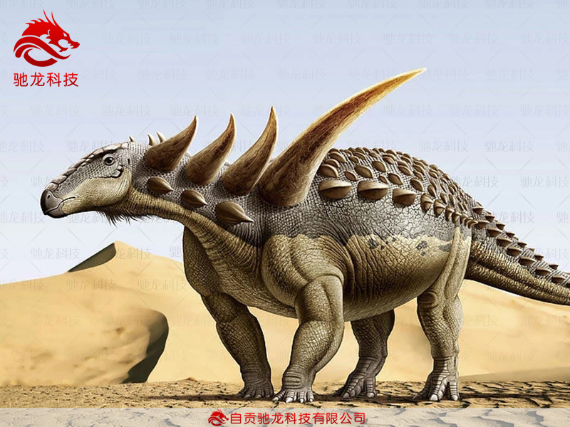
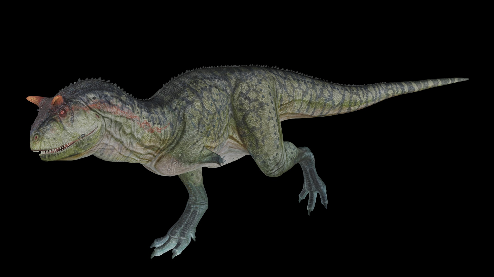
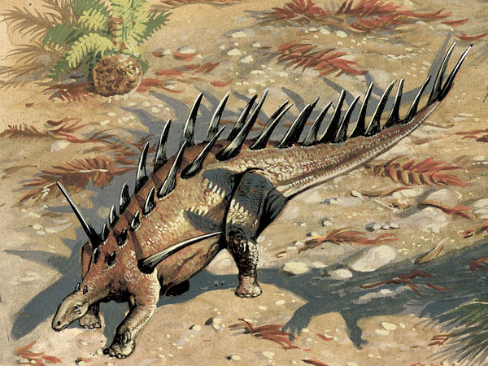
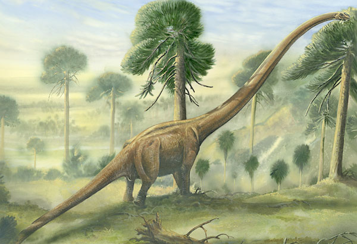

# Dinosaurs Image Classification

This repository follows the instruction on [YouTube](https://www.youtube.com/watch?v=QfNvhPx5Px8).

This model could be used to classify different types of dinosaurs.

## Prerequisites

[Docker](https://www.docker.com/products/docker-toolbox)

## Running

1. Download and start the docker image `docker run -it -v $dinosaurs_image_classification/dinosaurs:/tf tensorflow/tensorflow:latest-devel bash`
2. Run label_image to classify image. `python /tf/label_image_500.py  <path_to_image/file>` (500 training steps) or `python /tf/label_image_1000.py  <path_to_image/file>`(1000 training steps)

## Result

Final test accuracy = 82.1% (N=39) for 500 steps
Final test accuracy = 84.6% (N=39) for 1000 steps

### Testing with Animantarx

|  | Animantarx | Carnotaurus | Kentrosaurus | Mamenchisaurus |
| --- | --- | --- | --- | --- |
|  500 training steps | 0.52469 | 0.07295 | 0.02780 | 0.37456 |
| 1000 training steps | 0.68299 | 0.04873 | 0.01019 | 0.25809 |

### Testing with Mamenchisaurus

|  | Animantarx | Carnotaurus | Kentrosaurus | Mamenchisaurus |
| --- | --- | --- | --- | --- |
|  500 training steps | 0.02117 | 0.03466 | 0.02471 | 0.91945 |
| 1000 training steps | 0.01154 | 0.02290 | 0.01484 | 0.95071 |

## Retrain the model

1. Add new images/files into /tf/dinosaurs
2. Retrain by running `python retrain.py --bottleneck_dir=/tf/bottlenecks --how_many_training_steps <number_of_training_steps> --model_dir=/tf/inception --output_graph=/tf/retrained_graph.pb --output_labels=/tf/retrained_labels.txt --image_dir /tf/dinosaurs`

